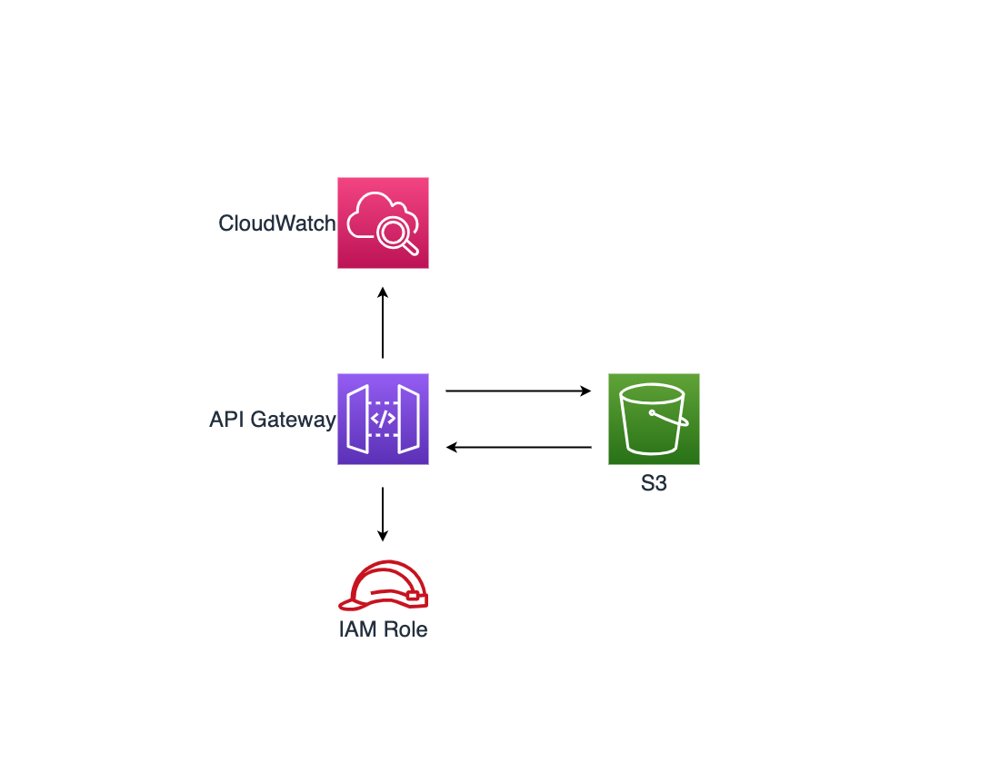

# aws-apigateway-s3 module
<!--BEGIN STABILITY BANNER-->

---


> All classes are under active development and subject to non-backward compatible changes or removal in any
> future version. These are not subject to the [Semantic Versioning](https://semver.org/) model.
> This means that while you may use them, you may need to update your source code when upgrading to a newer version of this package.

---
<!--END STABILITY BANNER-->

| **Reference Documentation**:| <span style="font-weight: normal">https://docs.aws.amazon.com/solutions/latest/constructs/</span>|
|:-------------|:-------------|
<div style="height:8px"></div>


| **Language**     | **Package**        |
|:-------------|-----------------|
| Typescript|`@aws-solutions-constructs/aws-apigateway-s3`|

## Overview

A Solutions Construct pattern that creates a REST API on Amazon API Gateway as an Amazon S3 proxy.

This construct exposes following operations on a S3 bucket:

* Expose GET on a Folder resource to view a list of all of the objects in an Amazon S3 bucket.
* Expose GET on a Folder/Item resource to view or download an object from an Amazon S3 bucket.
* Expose PUT on a Folder/Item resource to upload an object to an Amazon S3 bucket.
* Expose HEAD on a Folder/Item resource to get object metadata in an Amazon S3 bucket.
* Expose DELETE on a Folder/Item resource to remove an object from an Amazon S3 bucket.


Here is a minimal deployable pattern definition in Typescript:

``` typescript
import { AwsApigatewayS3Props, AwsApigatewayS3 } from "@aws-solutions-constructs/aws-apigateway-s3";

new AwsApigatewayS3(this, 'test-api-gateway-s3-default', {
    apiGatewayProps: {
        restApiName: 'S3 Proxy Service',
        description: "S3 Actions Proxy API"
    }
});

```

## Initializer

``` text
new AwsApigatewayS3(scope: Construct, id: string, props: AwsApigatewayS3Props);
```

_Parameters_

* scope [`Construct`](https://docs.aws.amazon.com/cdk/api/latest/docs/@aws-cdk_core.Construct.html)
* id `string`
* props [`AwsApigatewayS3Props`](#pattern-construct-props)

## Pattern Construct Props

| **Name**     | **Type**        | **Description** |
|:-------------|:----------------|-----------------|
|bucketProps?|[`s3.BucketProps`](https://docs.aws.amazon.com/cdk/api/latest/docs/@aws-cdk_aws-s3.BucketProps.html)|Optional user provided props to override the default props for S3 Bucket|
|additionalBuckets?|[`[s3.IBucket]`](https://docs.aws.amazon.com/cdk/api/v2/docs/aws-cdk-lib.aws_s3.IBucket.html)|Optional provide a list of IBucket objects type where you want the ApiGateway as proxy|
|apiGatewayProps?|[`api.RestApiProps`](https://docs.aws.amazon.com/cdk/api/latest/docs/@aws-cdk_aws-apigateway.RestApiProps.html)|Optional user-provided props to override the default props for the API Gateway.|
|allowCreateOperation?|`boolean`|Whether to deploy API Gateway Method for Upload operation on S3 Bucket.|
|allowReadOperation?|`boolean`|Whether to deploy API Gateway Method for Read operation on S3 Bucket.|
|allowDeleteOperation?|`boolean`|Whether to deploy API Gateway Method for Delete operation on S3 Bucket.|
|logGroupProps?|[`logs.LogGroupProps`](https://docs.aws.amazon.com/cdk/api/latest/docs/@aws-cdk_aws-logs.LogGroupProps.html)|User provided props to override the default props for for the CloudWatchLogs LogGroup.|

## Pattern Properties

| **Name**     | **Type**        | **Description** |
|:-------------|:----------------|-----------------|
|apiGateway|[`api.RestApi`](https://docs.aws.amazon.com/cdk/api/latest/docs/@aws-cdk_aws-apigateway.RestApi.html)|Returns an instance of the api.RestApi created by the construct.|
|apiGatewayRole|[`iam.Role`](https://docs.aws.amazon.com/cdk/api/latest/docs/@aws-cdk_aws-iam.Role.html)|Returns an instance of the iam.Role created by the construct for API Gateway.|
|s3Bucket|[`s3.Bucket`](https://docs.aws.amazon.com/cdk/api/latest/docs/@aws-cdk_aws-s3.Bucket.html)|Returns an instance of s3.Bucket created by the construct.|
|apiGatewayCloudWatchLogGroupRole|[`iam.Role`](https://docs.aws.amazon.com/cdk/api/latest/docs/@aws-cdk_aws-iam.Role.html)|Returns an instance of the iam.Role created by the construct for API Gateway for CloudWatch access.|
|apiGatewayLogGroup|[`logs.LogGroup`](https://docs.aws.amazon.com/cdk/api/latest/docs/@aws-cdk_aws-logs.LogGroup.html)|Returns an instance of the LogGroup created by the construct for API Gateway access logging to CloudWatch.|

## Default settings

Out of the box implementation of the Construct without any override will set the following defaults:

### Amazon API Gateway
* Deploy an regional API endpoint
* Enable CloudWatch logging for API Gateway
* Configure least privilege access IAM role for API Gateway
* Set the default authorizationType for all API methods to IAM

### Amazon S3 Bucket
* None

## Architecture


***
&copy; Copyright 2023 Amazon.com, Inc. or its affiliates. All Rights Reserved.